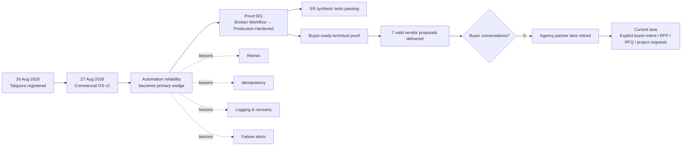

# Talquora Atlas 🗺️

A living visual history of what Talquora builds, tests, fixes, ships, kills and earns.

This is **not a marketing timeline**. Nodes should point to real evidence wherever possible: code, proofs, commits, public artifacts, experiments or commercial outcomes.

## The map

## Evidence-backed milestones

| Date | Milestone | Evidence |
|---|---|---|
| 2026-08-26 | Talquora business name registered | Business milestone |
| 2026-08-27 | Commercial OS v2 established | Operational milestone |
| 2026-08-30 | `proof_001` built and validated | [Proof 001](../talquora-proof-001/README.md) |
| 2026-09-01 | Proof 001 became default buyer-facing technical proof | [Proof 001](../talquora-proof-001/README.md) |
| 2026-09-01 | Generic agency-partner acquisition lane retired after 7 delivered proposals and 0 genuine buyer conversations | Commercial learning |

## What belongs in the Atlas

Add a node when something materially changes Talquora: a shipped system, completed proof, major failure and repair, acquisition experiment, killed idea, meaningful pivot, buyer conversation, customer, revenue milestone or reusable lesson.

Do **not** add routine research, repeated automation runs or internal busywork just to make the map look larger.

## North-star chain

`Build → Prove → Reach buyer → Conversation → Customer → Revenue → Repeat`

The Atlas should make it possible to zoom out years from now and see which branches went nowhere — and which ones became the business.
