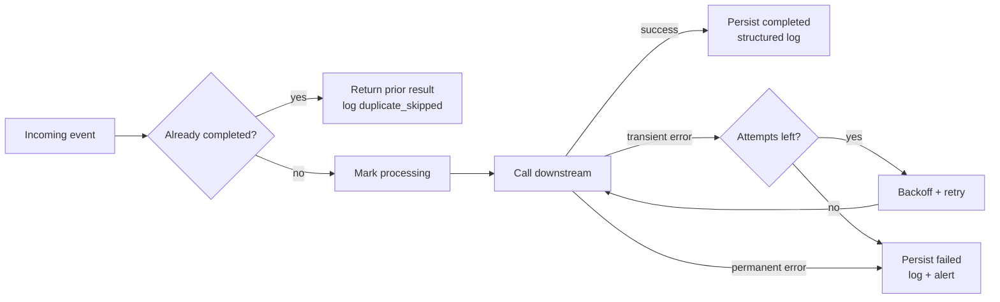

# Talquora Proof 001 — Broken Workflow → Production-Hardened

> **Synthetic demonstration.** This is not client work and does not claim production customer results. It is a reproducible technical proof showing how Talquora approaches unreliable automations.

## 2-minute summary

A deliberately fragile workflow sends an external side effect directly. If the same event arrives twice, it runs twice. If the downstream system times out, the workflow fails immediately. There is no durable state, retry policy, recovery record, or alert.

The hardened version adds the controls normally expected around business-critical automation:

- **Idempotency / duplicate prevention** — completed event IDs return the prior result instead of firing the side effect again.
- **Bounded retries with exponential backoff** — transient failures retry up to a fixed limit.
- **Safe failure state** — permanent/exhausted failures are recorded rather than silently disappearing.
- **Structured logging** — attempts, completions, duplicate skips and safe failures are auditable.
- **Recovery visibility** — the state store records whether an event is processing, completed or failed.
- **Monitoring / alerts** — terminal failures raise a high-severity workflow alert.
- **Automated tests** — the demo validates the broken failure mode and the hardened behavior.



## What the broken version gets wrong

```js
async function brokenWorkflow(event, downstream) {
  return downstream.send(event);
}
```

That is intentionally simple — and intentionally unsafe. A duplicate webhook can trigger duplicate work; a temporary timeout can kill an otherwise recoverable job; and a terminal failure has no durable audit trail.

## What changed

The hardened workflow wraps the same side effect with an event-state record, duplicate guard, bounded retry/backoff loop, explicit transient-vs-permanent error handling, durable success/failure state, structured logs, and a terminal alert.

The implementation is in [`demo.js`](./demo.js). The reproducible test suite is in [`test.js`](./test.js).

## Reproducible demo results

Run:

```bash
npm test
```

Validated synthetic test result:

| Test | Result | What it proves |
|---|---|---|
| Broken workflow duplicates side effect | PASS | The deliberately fragile version performs the same external action twice when a duplicate event arrives. |
| Hardened workflow skips duplicate | PASS | The hardened version performs one side effect and returns the stored result on repeat delivery. |
| Transient failures recover with bounded backoff | PASS | Two synthetic timeouts recover successfully on attempt 3. |
| Permanent failure fails safe and alerts | PASS | A terminal rejection becomes durable failed state and emits a high-severity alert. |
| Structured audit log records recovery path | PASS | Retry and completion events are captured as structured records. |

**Latest local validation:** 5 passed, 0 failed.

## Seed evidence captured in Talquora's automation environment

The same proof pattern was also seeded into a synthetic evidence workbook through Make with three event cases:

- `evt-dup` — first delivery completed; repeat delivery recorded as `duplicate_skipped` with no second side effect.
- `evt-retry` — two transient timeouts followed by successful recovery on attempt 3.
- `evt-fail` — permanent downstream rejection recorded as failed state with a high-severity workflow alert.

That seed run updated 20 rows / 86 cells across processed-events, logs, alerts and tests. Those are **demo records**, not production metrics.

## How this maps to Make / n8n work

The code is intentionally platform-neutral, but the controls map directly to common Make/n8n patterns:

- event ID / business-key datastore lookup before side effects;
- explicit error-handler routes for transient and terminal failures;
- retry counters + bounded delay/backoff;
- execution / audit logging to a datastore, Sheet, database or observability target;
- terminal alert route to email/Slack/Teams/etc.;
- replay-safe recovery using persisted state rather than blind re-execution.

## What Talquora can credibly do on a similar workflow

For an existing automation, Talquora can inspect the failure path, identify duplicate/replay risks, add idempotency controls, separate transient from terminal errors, introduce bounded retries, make failures observable, add recovery state, and document/test the resulting behavior.

The claim demonstrated here is **engineering approach and implementation capability**, not prior client outcomes.
